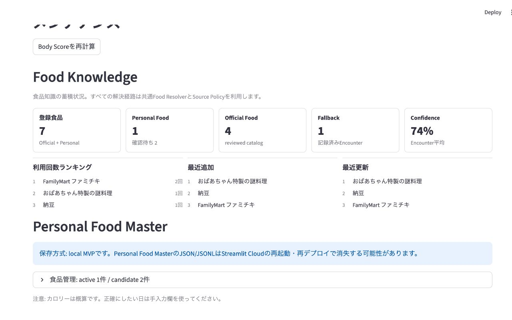
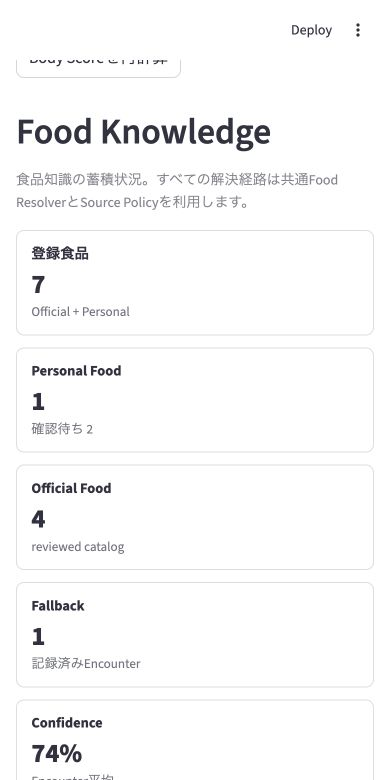

# Food Knowledge Foundation

## Purpose

PR11 establishes one Food Knowledge resolution path for manual entry, JSON import, calorie estimation, encounter capture, and Nutrition Intelligence. Parsing, identity resolution, source selection, persistence, and scoring remain separate responsibilities.

```text
Food input
  -> Food Parser
  -> Food Resolver
       -> Explicit candidate
       -> Personal Food Master candidate
       -> Official catalog candidate
       -> Generic catalog candidate
       -> Fallback candidate
  -> Source Policy
  -> Nutrition Resolution
```

`food_resolver.resolve_food_text()` is the only application-level food-resolution entry point. `food_lookup.lookup_food()` remains a lower-level official-catalog adapter for compatibility and focused catalog tests; application consumers must not call it directly.

## Source Policy

Food candidates are collected before selection. `food_source_policy.select_food_resolution_candidate()` applies the same product-level order everywhere:

1. `explicit`
2. `personal`
3. `official`
4. `generic`
5. `fallback`

Source authority, validity, freshness, verification status, and same-tier conflicts are still evaluated inside the selected product-level tier. A Personal Food Master record may contain official or user-verified source metadata, but its product-level origin remains `personal` because it represents the user's reviewed identity.

## Pure Resolution

The resolver does not read files, call Streamlit, access a network, or write a repository. It receives a copied Food Knowledge snapshot:

```python
knowledge = build_food_knowledge_snapshot(personal_foods)
result = resolve_food_text(text, meal_type, knowledge=knowledge)
```

`app.py` reads the repository and creates the snapshot. Nutrition Intelligence receives the same snapshot as an optional argument and remains a pure function. Without a snapshot, it uses the immutable local official and generic catalogs and no Personal Food data.

## Repository Boundary

`FoodMasterRepository` owns personal foods and encounters. The interface exposes food listing, lookup, upsert, archive, candidate listing, idempotent encounter append/lookup, encounter listing, and copied knowledge snapshots.

`JsonFoodMasterRepository` remains the PR11 adapter. Its local JSON/JSONL files are not durable on Streamlit Cloud. Resolver and dashboard code do not depend on JSON paths or serialization, so a future repository can replace it without changing nutrition rules.

## Resolver Result

The result includes resolver/source-policy versions, parser output, per-item candidate selection, selected origin, quantity-adjusted nutrition, meal totals, confidence, review state, detected/unresolved items, counts by resolution origin, source distribution, and source-policy decisions.

This result is projected into the existing calorie-estimation contract. No resolver fields are added to `records.csv`.

## Dashboard And Import Summary

The Food Knowledge dashboard is a read-only projection of repository and official-catalog state. It shows registered, Personal, Official, and Fallback counts, encounter confidence, usage ranking, and recent additions/updates. The existing Personal Food Master management expander remains separate.

After JSON import, BodyOS shows Food Master, Official, Generic, and Fallback resolution counts. Explicit nutrition is shown when present. These values are operational metrics and are not persisted in the daily CSV schema.

## PR12 Handoff: Supabase Migration

- Implement a Supabase adapter for `FoodMasterRepository`; do not add Supabase calls to the resolver.
- Map `owner_user_id` to authenticated ownership and enforce row-level security.
- Normalize foods, aliases, nutrition sources, and encounters while preserving schema versions and idempotency keys.
- Add a transaction or unit-of-work operation so one save/import persists related foods and encounters atomically.
- Define migration, rollback, reconciliation, retry, and local-to-cloud import procedures.
- Add indexes for normalized identity, aliases, record date, idempotency key, status, use count, and update time.
- Replace local durability warnings only after hosted persistence and recovery are verified.

## PR13 Handoff: Smart Food Capture

- Treat OCR output as Food Input and always send it through Parser and Resolver.
- Keep image/OCR storage outside Food Master records and link captures through stable IDs.
- Store OCR raw text, bounding boxes, confidence, model/version, corrections, and provenance separately.
- Convert confirmed package labels to explicit nutrition candidates without bypassing Source Policy.
- Preserve brand, variant, size, quantity, and serving basis before nutrition selection.
- Add review for low-confidence OCR and ambiguous candidates; do not auto-promote them.

## Known Technical Debt

- The generic catalog adapts legacy calorie-only dictionaries, so most PFC values remain unknown.
- Official catalog coverage is intentionally small and updated manually.
- JSON storage rewrites the full personal master file and has no cross-file transaction.
- Identity matching is deterministic; spelling variants outside current aliases remain reviewable.
- Food Knowledge metrics scan local encounters at render time; a database backend should aggregate in queries.
- Historical CSV calories are not backfilled with provenance until an explicit migration workflow exists.

## UI Validation

The screenshots use the actual Streamlit app with temporary local Food Knowledge validation data. The temporary JSON/JSONL data is not committed.

### Desktop 1280px



### Mobile 390px


