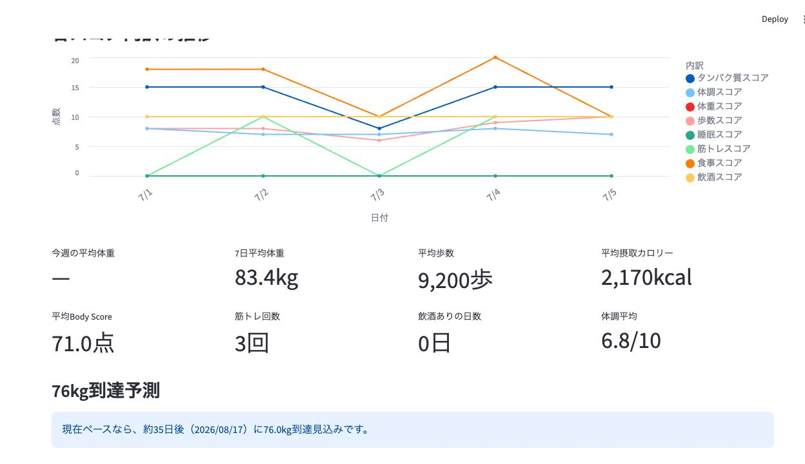
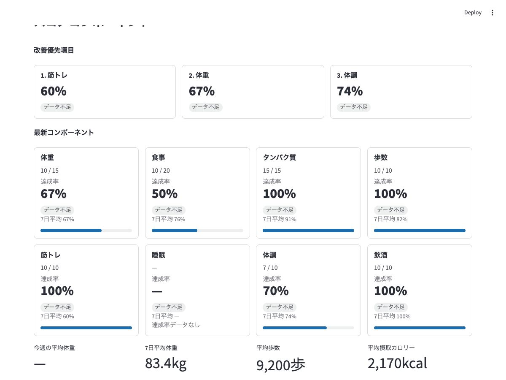
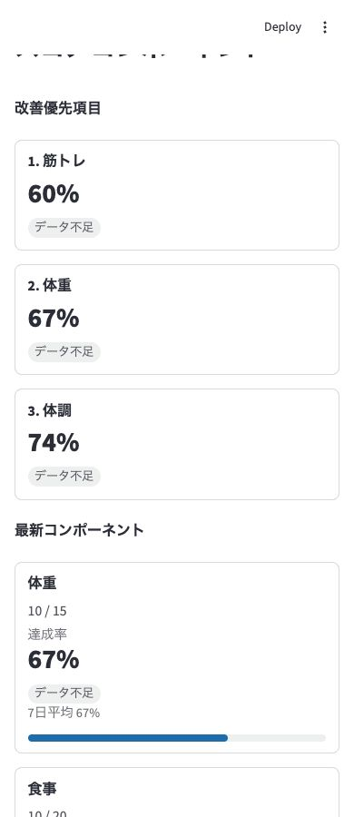
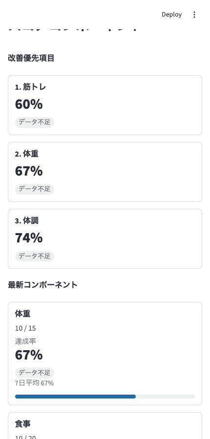

# PR7.2 UI Validation

## Setup

Streamlit was run against temporary validation worktrees so the repository `records.csv` was not changed.

- Before: `origin/main` on `http://localhost:8522`
- After: PR7.2 branch on `http://localhost:8523`

Validation data used five records from 2026-07-01 to 2026-07-05.

The latest validation record included:

- `食事スコア`: `10 / 20` -> `50%`
- `歩数スコア`: `10 / 10` -> `100%`
- `睡眠スコア`: missing for all validation records -> `—`

The dataset has fewer than seven days, so seven-day averages are calculated from available valid records and trend labels display `データ不足`.

## Screenshots

Before PR7.2, raw component scores were displayed together in one crowded multi-line chart:

After PR7.2, the normalized component UI shows improvement priorities, actual / maximum values, percentages, seven-day averages, and concise trend labels:

After PR7.2, the same component UI remains readable in a 390px mobile viewport:

After PR7.2, the component UI also remains readable in a 430px mobile viewport:

## Confirmed

- Different maxima normalize correctly: `10 / 10` displays `100%`; `10 / 20` displays `50%`.
- Missing score values display as `—` and are not treated as 0%.
- The all-missing `睡眠スコア` is excluded from `改善優先項目`.
- All score component cards render with actual / maximum, achievement percentage, seven-day average, and trend label.
- Less than seven days of data still produces seven-day averages from available valid records.
- Trend labels display `データ不足` when there is not enough preceding data.
- Desktop width 1200px renders component cards in four columns.
- Mobile widths 390px and 430px render priority items and component cards in one column.
- Mobile widths 390px and 430px have no horizontal overflow (`bodyOverflow`, `mainOverflow`, `sectionOverflow`, and max card overflow were all 0).
- Mobile cards preserve readable actual / maximum values, achievement percentage, seven-day average, and trend labels without text clipping.
- Existing `Body Score` values rendered unchanged from the validation CSV.
- Streamlit rendered without exceptions in before, after, and narrow-width validation runs.
- `records.csv` in the PR worktree has no diff.
- No CSV schema changes or historical rewrites were performed.
