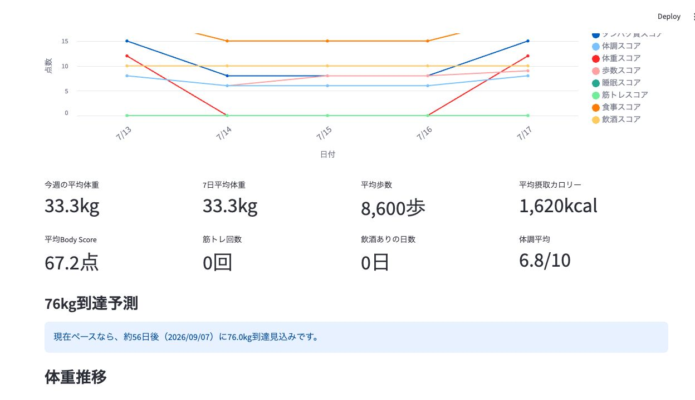
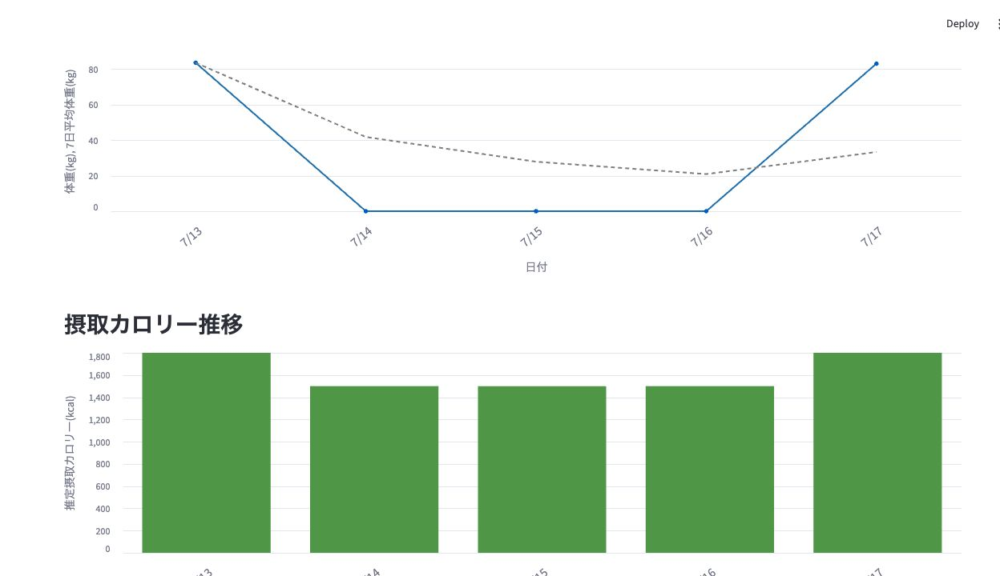
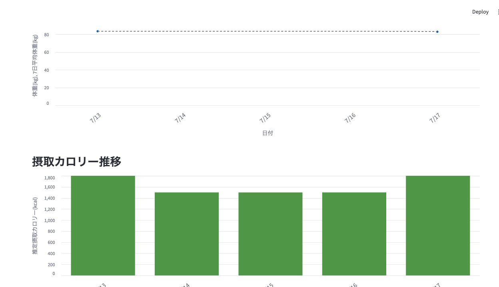
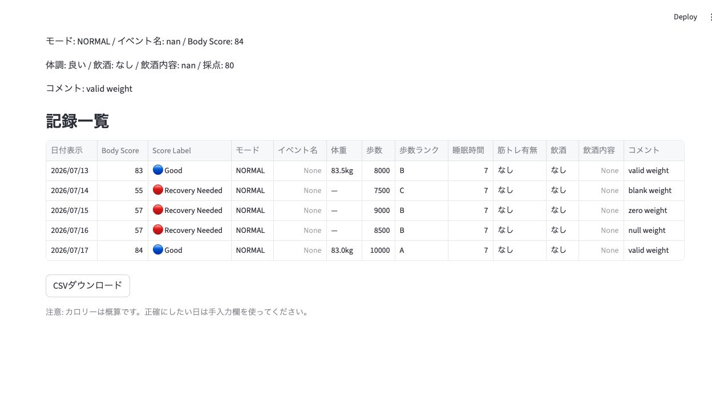
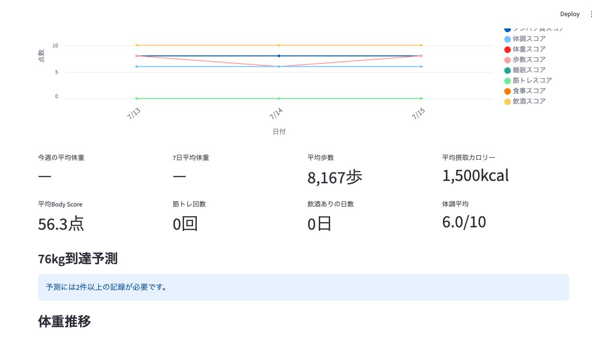

# PR7.5 UI Validation

## Setup

Streamlit was run against temporary validation worktrees so the repository `records.csv` was not changed.

- Before: `origin/main` on `http://localhost:8517`
- After: PR17 branch on `http://localhost:8518`
- All-missing case: PR17 branch on `http://localhost:8519`

Validation week: 2026-07-13 to 2026-07-17.

Mixed-weight validation data included:

- valid weight: `83.5`
- blank weight
- `0`
- `null`
- valid weight: `83.0`

Expected valid-only average:

```text
(83.5 + 83.0) / 2 = 83.25 -> 83.2kg
```

## Screenshots

Before PR17, missing weights were treated as zero and pulled averages down:



Before PR17, the weight chart drew zero-weight points:



After PR17, weekly and seven-day averages use only valid weights:


After PR17, the weight chart has no 0kg points for missing days:



After PR17, missing daily weights display as `—` in the history table:



After PR17, all-missing weight data displays `—` for the weekly and seven-day averages:



## Confirmed

- `今週の平均体重` is calculated from valid weights only: before `33.3kg`, after `83.2kg`.
- `7日平均体重` is not pulled down by zero values: before `33.3kg`, after `83.2kg`.
- Missing daily weights display as `—` in the history table.
- The weight trend chart no longer draws 0kg points for missing days.
- All-missing weight data displays `—` for both `今週の平均体重` and `7日平均体重`.
- Streamlit rendered without exceptions in all three validation runs.
- `records.csv` in the PR worktree has no diff.
