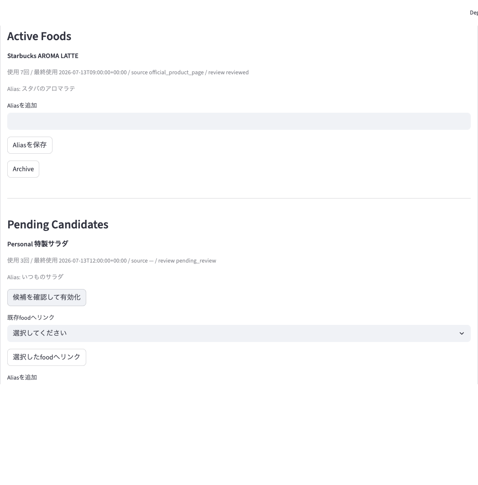
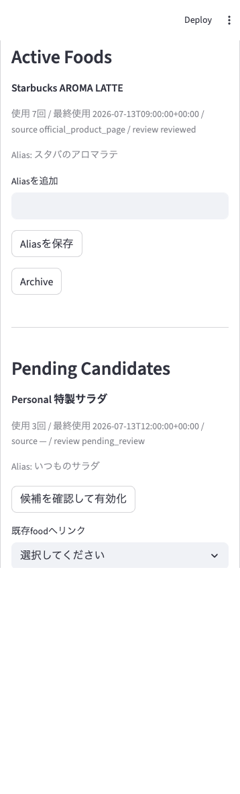

# PR9 UI Validation

The Personal Food Master management panel was checked in a running Streamlit
application with a representative active food and pending candidate.

## Desktop

- Viewport: 1280 x 900
- Active food details, source type, review status, aliases, usage count, and
  archive action render together.
- Pending candidate details, confirmation action, existing-food link, alias
  action, and archive action render together.

## Mobile

- Viewport: 390 x 844
- The panel has no horizontal overflow (`scrollWidth == clientWidth == 390`).
- Active and pending cards stack vertically and preserve readable labels.

